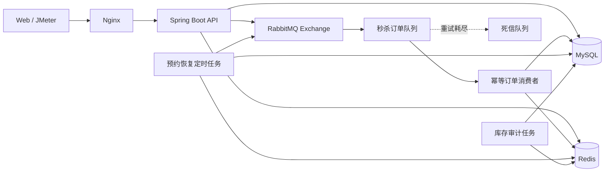
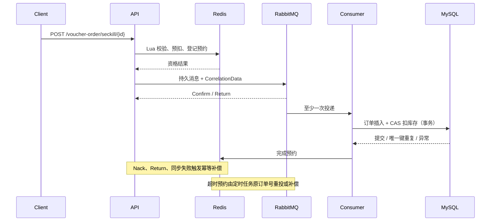

# 系统架构

```mermaid
flowchart LR
    U[Web / JMeter] --> N[Nginx]
    N --> A[Spring Boot API]
    A --> M[(MySQL)]
    A --> R[(Redis)]
    A --> Q[RabbitMQ Exchange]
    Q --> W[秒杀订单队列]
    W --> C[幂等订单消费者]
    C --> M
    C --> R
    W -.重试耗尽.-> D[死信队列]
    S[预约恢复定时任务] --> R
    S --> M
    S --> Q
    T[库存审计任务] --> R
    T --> M
```

## 秒杀时序

```mermaid
sequenceDiagram
    participant Client
    participant API
    participant Redis
    participant MQ as RabbitMQ
    participant Consumer
    participant DB as MySQL

    Client->>API: POST /voucher-order/seckill/{id}
    API->>Redis: Lua 校验、预扣、登记预约
    Redis-->>API: 资格结果
    API->>MQ: 持久消息 + CorrelationData
    MQ-->>API: Confirm / Return
    MQ->>Consumer: 至少一次投递
    Consumer->>DB: 订单插入 + CAS 扣库存（事务）
    DB-->>Consumer: 提交 / 唯一键重复 / 异常
    Consumer->>Redis: 完成预约
    Note over API,Redis: Nack、Return、同步失败触发幂等补偿
    Note over Redis,MQ: 超时预约由定时任务原订单号重投或补偿
```
